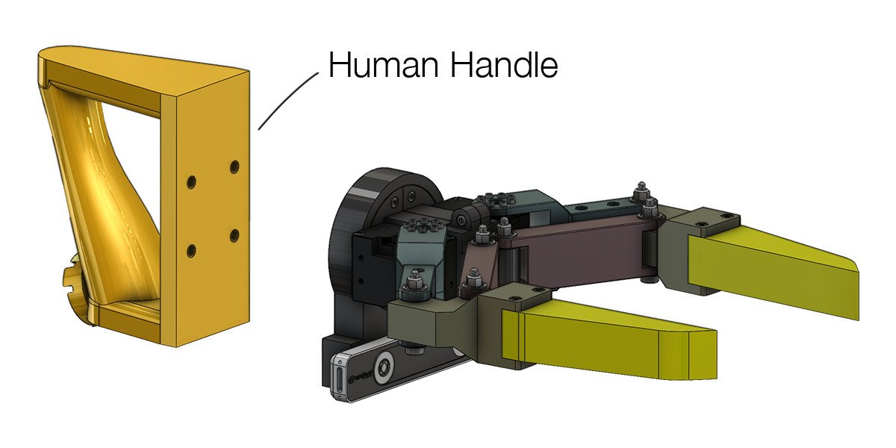
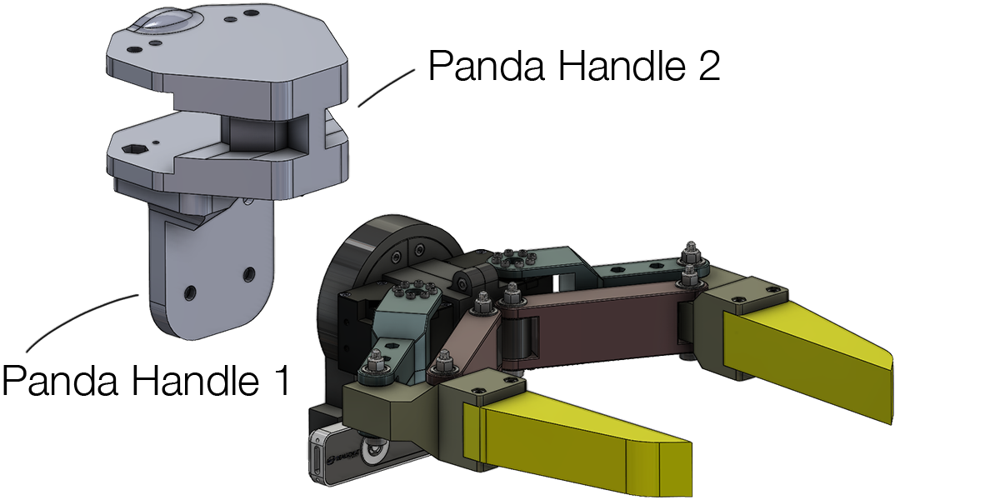
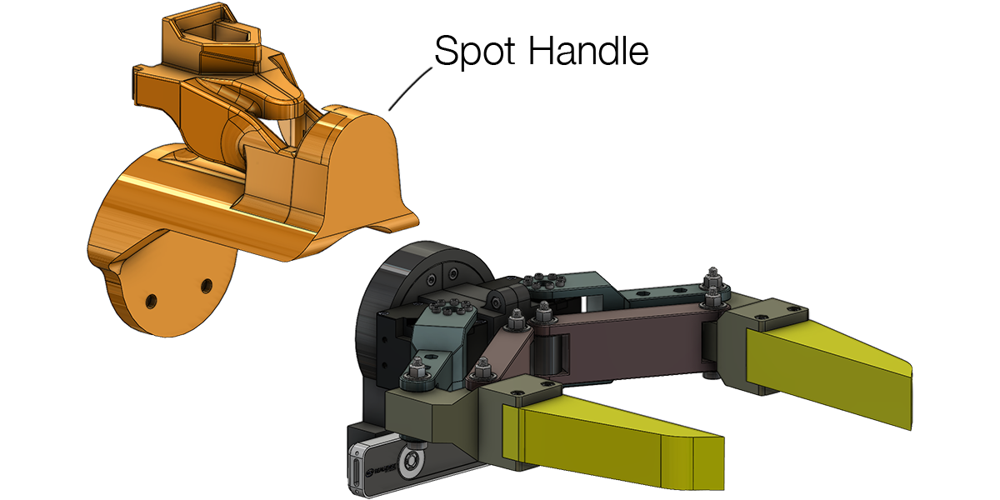

<link media="all" href="./css/glab.css" type="text/css" rel="StyleSheet">
<link href='https://fonts.googleapis.com/css?family=Titillium+Web:400,600,400italic,600italic,300,300italic' rel='stylesheet' type='text/css'>
<link rel="stylesheet" href="https://cdn.jsdelivr.net/gh/jpswalsh/academicons@1/css/academicons.min.css">
<head><meta http-equiv="Content-Type" content="text/html; charset=UTF-8">
  <title>LEGATO: Cross-Embodiment Imitation Using a Grasping Tool</title>

<!-- <meta property="og:image" content="src/figure/approach.png"> -->
<meta property="og:title" content="LEGATO">

<!-- Google tag (gtag.js) -->

<!-- STLviewer tag -->
<!--  -->

<meta content="MSHTML 6.00.2800.1400" name="GENERATOR">

</head>

<body data-gr-c-s-loaded="true">

<table align=center width=800px>
  <tr>
    <td>
      

        <h1 align="left">
          <strong>LEGATO Gripper Hardware Manual </strong>
        </h1>
      

    </td>
  </tr>
</table>

<table align=center width=800px>
  <tr>
    <td>
      

      <h2>Overview</h2>
      <b>LEGATO Gripper</b> is a hand-held gripper developed in <a href="https://ut-hcrl.github.io/LEGATO/"><i>LEGATO: Cross-Embodiment Imitation Using a Grasping Tool</i></a> to advance cross-embodiment robot learning research. Created by <a href="https://mingyoseo.com/">Mingyo Seo</a> and <a href="https://yuanshenli.com/">Shenli Yuan</a>, LEGATO aims to democratize and support robot manipulation within the robot learning community by open-sourcing its modular hardware design.
      

    </td>
  </tr>
  <tr>
    <td align="center" valign="middle">
      
    </td>
  </tr> 
  <tr>
    <td>
      

        We currently provide the following materials from this open-source project as a preview. More detailed documentation will be updated soon. 
        - Bill of materials
          <a href="#bom">
            <i class="fa-solid fa-link"></i>
          </a>
           
        - 3D-printing parts
          <a href="#3d-printing">
            <i class="fa-solid fa-link"></i>
          </a>
           
        - Assembly instructions
          <a href="#assembly">
            <i class="fa-solid fa-link"></i>
          </a>
           
        - Python-based hardware control interface 
          <a href="https://github.com/UT-HCRL/LEGATO/blob/main/scripts/real_demo.py">
            <i class="fa-solid fa-link"></i>
          </a>
           
        - Simulation models for MuJoCo
          <a href="https://github.com/UT-HCRL/LEGATO/tree/main/models/grippers/legato">
            <i class="fa-solid fa-link"></i>
          </a>
      

    </td>
  </tr>
</table>

<table align=center width=800px>
  <tr>
    <td>
      <h2 id="bom">Bill of Materials</h2>
        Here is the list of off-the-shelf parts required to assemble one set of shared gripper components. Although ISO bolts from McMaster-Carr are specified in this list, any compatible bolts may be used as alternatives.
    </td>
  </tr>
  <tr>
    <td>
  <table class="bom_table" width=800px>
    <thead>
      <tr>
        <th></th>
        <th align="center">Item</th>
        <th align="center">Quantity</th>
        <th align="center">Unit Cost</th>
        <th align="center">Total Cost</th>
        <th align="center">Link</th>
      </tr>
    </thead>
    <tbody>
      <tr>
        <td>
          
        </td>
        <td align="left">Dynamixel XM430-W350R</td>
        <td>2</td>
        <td>289.9</td>
        <td>579.8</td>
        <td>
          <a href="https://www.robotis.us/dynamixel-xm430-w350-r/">
            <i class="fa-solid fa-link"></i>
          </a>
        </td>
      </tr>
      <tr>
        <td>
          
        </td>
        <td align="left">RealSense T265  
          (currently discontinued, <a href="https://www.xvisiotech.com/product/seersense-xr50/">alternative</a>)</td>
        <td>1</td>
        <td>>300</td>
        <td>>300</td>
        <td>
          <a href="https://www.intelrealsense.com/visual-inertial-tracking-case-study/">
            <i class="fa-solid fa-link"></i>
          </a>
        </td>
      </tr>
      <tr>
        <td>
          </td>
        <td align="left">
          Flanged Ball Bearing  
          (package of 4)
        </td>
        <td>1</td>
        <td>6.89</td>
        <td>20.67</td>
        <td>
          <a href="https://www.amazon.com/uxcell-MF115ZZ-5x11x4mm-Shielded-Bearings/dp/B0CGX9V7BJ/ref=sr_1_2_sspa?crid=3PF2S9LI7A1T4&dib=eyJ2IjoiMSJ9.J4ElrzRhUBgUWQ5Y6RcCKjgQ7qF7u3sM__EOKdUZXjqT0ajGkUfDOEpsJ8vVTjTyaS5v1V5RhTPS1In6qqYoRc9vublnByuAmWMiK4-ZmPcTWrAfn9S_tmF-m9Fus07cJBexfYLJ4q3ZvESbSCHYdciZZSZ_G69mMIOYpQXwcbRRc9KYk9ZCHtVfireuBIHu-7fZ_M3v2_lhZ7mCuzv28geOUFqQ-XfkYK_E42nJzc4.9B7G94vt0aaOiuilRCN1HGAgXWoqND7B69x1rg7OwZc&dib_tag=se&keywords=5x11%2Bflanged%2Bbearing&qid=1724780488&sprefix=5x11%2Bflanged%2Bb%2Caps%2C116&sr=8-2-spons&sp_csd=d2lkZ2V0TmFtZT1zcF9hdGY&th=1">
            <i class="fa-solid fa-link"></i>
          </a>
        </td>
      </tr>    <tr>
        <td>
          
        </td>
        <td align="left"> Alloy Steel Shoulder Screws  
          &#8960; 5mm x 30mm Shoulder, M4 x 0.7mm Thread</td>
        <td>6</td>
        <td>3.03</td>
        <td>18.18</td>
        <td>
          <a href="https://www.mcmaster.com/92981A055/">
            <i class="fa-solid fa-link"></i>
          </a>
        </td>
      </tr>
      <tr>
        <td>
          
        </td>
        <td align="left">M4 x 0.7mm Locknut  
          (package of 100, 6 required)
        </td>
        <td>1</td>
        <td>5.57</td>
        <td>5.57</td>
        <td>
          <a href="https://www.mcmaster.com/90576A103/">
            <i class="fa-solid fa-link"></i>
          </a>
        </td>
      </tr>
      <tr>
        <td>
          </td>
        <td align="left">
          Heat Set Insert  
          M3 x 0.5mm Thread Size, 3.8 mm Installed Length  
          (Package of 100, 4 required)
        </td>
        <td>1</td>
        <td>20.44</td>
        <td>20.44</td>
        <td>
          <a href="https://www.mcmaster.com/94180A331/">
            <i class="fa-solid fa-link"></i>
          </a>
        </td>
      </tr>
      <tr>
        <td>
          
        </td>
        <td align="left">
          M3 x 30mm Long Socket Head Screws  
          (pack of 50, 4 required)</td>
        <td>1</td>
        <td>13.68</td>
        <td>13.68</td>
        <td>
          <a href="https://www.mcmaster.com/91290A130/">
            <i class="fa-solid fa-link"></i>
          </a>
        </td>
      </tr>
      <tr>
        <td>
          
        </td>
        <td align="left">
          M3 x 12mm Long Socket Head Screws  
          (pack of 100, 10 required)
        </td>
        <td>1</td>
        <td>11.29</td>
        <td>11.29</td>
        <td>
          <a href="https://www.mcmaster.com/91290A117/">
            <i class="fa-solid fa-link"></i>
          </a>
        </td>
      </tr>
      <tr>
        <td>
          </td>
        <td align="left">
          M3 x 0.5 mm Nut  
          (packge of 100, 10 required)
        </td>
        <td>1</td>
        <td>2.81</td>
        <td>2.81</td>
        <td>
          <a href="https://www.mcmaster.com/90591A250/">
            <i class="fa-solid fa-link"></i>
          </a>
        </td>
      </tr>
      <tr>
        <td>
          
        </td>
        <td align="left">
          M6 x 14mm Long Socket Head Screws  
          (pack of 100, 4-6 required)
        </td>
        <td>1</td>
        <td>19.69</td>
        <td>19.69</td>
        <td>
          <a href="https://www.mcmaster.com/91290A319/">
            <i class="fa-solid fa-link"></i>
          </a>
        </td>
      </tr>
      <tr>
        <td>
          
        </td>
        <td align="left">
          M6 x 1mm Nut  
          (packge of 100, 4-6 required)
        </td>
        <td>1</td>
        <td>3.14</td>
        <td>3.14</td>
        <td>
          <a href="https://www.mcmaster.com/90591A151/">
            <i class="fa-solid fa-link"></i>
          </a>
        </td>
      </tr>
      <tr>
        <td>
          
        </td>
        <td align="left">
          M2.5 x 8mm Long Socket Head Screws  
          (packge of 50, 2 required)
        </td>
        <td>1</td>
        <td>11.42</td>
        <td>11.42</td>
        <td>
          <a href="https://www.mcmaster.com/91290A102/">
            <i class="fa-solid fa-link"></i>
          </a>
        </td>
      </tr>
      <tr>
        <td>
          
        </td>
        <td align="left">
          M2.5 x 6mm Long Socket Head Screws  
          (packge of 50, 8 required)
        </td>
        <td>1</td>
        <td>11.56</td>
        <td>11.56</td>
        <td>
          <a href="https://www.mcmaster.com/91290A101/">
            <i class="fa-solid fa-link"></i>
          </a>
        </td>
      </tr>
      <tr>
        <td>
          </td>
        <td align="left">
          M2 x 6mm Long Socket Head Screws  
          (packge of 100, 16-32 required)
        </td>
        <td>1</td>
        <td>15.68</td>
        <td>15.68</td>
        <td>
          <a href="https://www.mcmaster.com/91290A013/">
            <i class="fa-solid fa-link"></i>
          </a>
        </td>
      </tr>
    </tbody>
    <!-- Add more rows as needed -->
  </table>

  Other than the above components, the follow materials, 3D-printing filaments, and friction tapes are requred to assembly one set of the Gripper. The below table is the example of the items, but any compatible alternative can be used.
  <tr>
    <td>
      <table class="bom_table" width=800px>
        <thead>
          <tr>
            <th align="center">Item</th>
            <th align="center">Cost</th>
            <th align="center">Link</th>
          </tr>
        </thead>
        <tbody>
          <tr>
            <td>PLA 3D-printing filment</td>
            <td>19.99</td>
            <td>
              <a href="https://us.store.bambulab.com/collections/bambu-lab-3d-printer-filament/products/pla-basic-filament?variant=40988815556744">
                <i class="fa-solid fa-link"></i>
              </a>
            </td>
          </tr>
          <tr>
            <td>TPU 95A 3D-printing filment</td>
            <td>41.99</td>
            <td>
              <a href="https://us.store.bambulab.com/products/tpu-95a-hf?variant=41469410574472&gad_source=1&gbraid=0AAAAAo9so7Mnq9dBoYJCZT9qhxX--nFPk&gclid=Cj0KCQiA_9u5BhCUARIsABbMSPs7GjAXj9b3UcQHJ1c3Kl4N9_0P4JgJ0F0yi0IOceZZ8hs0rVbEUeYaAkWEEALw_wcB">
                <i class="fa-solid fa-link"></i>
              </a>
            </td>
          </tr>
          <tr>
            <td>Friction tape</td>
            <td>49.00</td>
            <td>
              <a href="https://www.amazon.com/3M-Gripping-Material-TB641-Black/dp/B0093CQPW8/ref=rvi_d_sccl_2/139-6753142-7229065?pd_rd_w=2uS3u&content-id=amzn1.sym.f5690a4d-f2bb-45d9-9d1b-736fee412437&pf_rd_p=f5690a4d-f2bb-45d9-9d1b-736fee412437&pf_rd_r=JKBXYDN7ZCPMKKHYD209&pd_rd_wg=Os9qF&pd_rd_r=c9375c68-65f9-44d2-8931-4029d14647d8&pd_rd_i=B0093CQPW8&psc=1">
                <i class="fa-solid fa-link"></i>
              </a>
            </td>
          </tr>
        </tbody>
      </table>
    </td>
  </tr>
    </td>
  </tr>
</table>

<table align=center width=800px>
  <tr>
    <td>

<h2 id="3d-printing"> 3D-printing Parts</h2>

Here is the list of 3D-printed parts required to assemble one set of shared gripper components, along with optional handles for robots and a human demonstrator. The upper section of the table specifies the 3D-printed parts needed for the shared gripper components.
    </td>
  </tr>
  <tr>
    <td>
<table class="bom_table">
  <thead>
  <tr>
      <th></th>
      <th>Item</th>
      <th>Material</th>
      <th>Quantity</th>
      <th>File</th>
  </tr>
  </thead>
  <tbody>
    <tr>
      <td>
        
      </td>
      <td>Base</td>
      <td>PLA</td>
      <td>1</td>
      <td>
        <a href="./src/stl/gripper/Base.STL" download>
          <i class="fa-solid fa-download"></i>
        </a>
      </td>
    </tr>
    <tr>
      <td>
        
      </td>
      <td>Dynamixel Mount</td>
      <td>PLA</td>
      <td>2</td>
      <td>
        <a href="./src/stl/gripper/Dynamixel_Mount.STL" download>
          <i class="fa-solid fa-download"></i>
        </a>
      </td>
    </tr>
    <tr>
      <td>
        
      </td>
      <td>Finger Link</td>
      <td>PLA</td>
      <td>2</td>
      <td>
        <a href="./src/stl/gripper/Finger_Link.STL" download>
          <i class="fa-solid fa-download"></i>
        </a>
      </td>
    </tr>
    <tr>
      <td>
        
      </td>
      <td>Upper Link</td>
      <td>PLA</td>
      <td>2</td>
      <td>
        <a href="./src/stl/gripper/Upper_Link.STL" download>
          <i class="fa-solid fa-download"></i>
        </a>
      </td>
    </tr>
    <tr>
      <td>
        
      </td>
      <td>Lower Link Half</td>
      <td>PLA</td>
      <td>4</td>
      <td>
        <a href="./src/stl/gripper/Lower_Link_Half.STL" download>
          <i class="fa-solid fa-download"></i>
        </a>
      </td>
    </tr>
  </tbody>
  <tbody class="table_bottom">
  <tr>
    <td>
      
    </td>
    <td>Finger Tip</td>
    <td>TPU 95A</td>
    <td>2</td>
    <td>
      coming 
      soon
    </td>
  </tr>
  </tbody>
  <tbody class="table_bottom">
  <tr>
    <td>
      
    </td>
    <td>Human Handle</td>
    <td>PLA</td>
    <td>1</td>
    <td>
      <a href="./src/stl/handle/Human_Handle.STL" download>
        <i class="fa-solid fa-download"></i>
      </a>
    </td>
  </tr>
  </tbody>
  <tbody class="table_bottom">
  <tr>
    <td>
      
    </td>
    <td>Spot Handle</td>
    <td>PLA</td>
    <td>1</td>
    <td>
      <a href="./src/stl/handle/Spot_Handle.STL" download>
        <i class="fa-solid fa-download"></i>
      </a>
    </td>
  </tr>
  </tbody>
  <tbody>
    <tr>
      <td>
        
      </td>
      <td>Panda Handle 1</td>
      <td>PLA</td>
      <td>1</td>
      <td>
        <a href="./src/stl/handle/Panda_Handle_1.STL" download>
          <i class="fa-solid fa-download"></i>
        </a>
      </td>
    </tr>
    <tr>
      <td>
        
      </td>
      <td>Panda Handle 2</td>
      <td>PLA</td>
      <td>1</td>
      <td>
        <a href="./src/stl/handle/Panda_Handle_2.STL" download>
          <i class="fa-solid fa-download"></i>
        </a>
      </td>
    </tr>
  </tbody>
  <!-- Add more rows as needed -->
</table>

  </td>
  </tr>
</table>

<table align=center width=800px>
  <tr>
    <td>
      <h2 id="assembly">Assembly Instruction</h2>
      Follow the video instructions below to assemble the shareable gripper components. Before assembly, use an appropriate press machine, such as 
      <a href="https://www.amazon.com/3DZWMAN-Vertical-Pressing-Machine-Printing/dp/B0BBSGG2S2/ref=sr_1_1_sspa?dib=eyJ2IjoiMSJ9.xwi5Z8Ac4o3C40kX2ATKJwKk8eZqPJHUw5pG6q7IVynCw7m4Z9II0Yw5ikXZk_0J-L52c3eaPi4GRs3z4IvAQMZc_wPrsfLugLdTQ4cVNZFyAKIVB0zg7ocLbHI-CUrX0vZlf7S26PNKQyEf-MfhjPZOZKIcOYGnmbMcErEFxARiBBNik6BFuaAgT36ClVihWKKAkYPFNyHZ2yHCe8kG__21kJIc-RTuV_TYTJRv-aU.vILq6JWPMIB46ILT9h3FteaFW0lgeJ6shOrOTYJAYQk&dib_tag=se&keywords=heat+insert+tool&qid=1731134766&sr=8-1-spons&sp_csd=d2lkZ2V0TmFtZT1zcF9hdGY&psc=1
      ">
        <i class="fa-solid fa-link"></i>
      </a>, 
      to heat-set inserts into the <i>Base</i> part.
    </td>
  </tr>
  <tr>
    <td>
  <table border="0" cellspacing="10" cellpadding="0" align="center">
    <tbody>
      <tr>
        <td align="center" valign="middle">
          <video muted controls autoplay loop width="598">
            <source src="./src/video/assembly.mp4"  type="video/mp4">
          </video>
        </td>
      </tr>
    </tbody>
  </table>
    </td>
  </tr>
  <tr>
    <td>
      For use, you can assemble the sharabe gripper with the corresponding handles. Currently, we provide three types of handles: one for a human demonstrator, one for the Franka Emika <i>Panda</i>, and one for the Boston Dynamics <i>Spot</i>. The assembly instructions are shown in the following figures.
    </td>
  </tr>
  <tr>
    <td>
  <table border="0" cellspacing="10" cellpadding="0" align="center">
    <tbody>
      <tr>
        <td align="center" valign="middle">
          
        </td>
        <td align="center" valign="middle">
          
        </td>
        <td align="center" valign="middle">
          
        </td>
      </tr>
    </tbody>
  </table>
    </td>
  </tr>
</table>

<table align=center width=800px>
  <tr>
    <td>
      <h2>Citation</h2>
    </td>
  </tr>
  <tr>
    <td>
    <!-- <left> -->
    <pre><code style="display:block; overflow-x: auto">
      @misc{seo2024legato,
        title={LEGATO: Cross-Embodiment Visual Imitation Using a Grasping Tool},
        author={Seo, Mingyo and Park, H. Andy and Yuan, Shenli and Zhu, Yuke and
          and Sentis, Luis},
        year={2024}
        eprint={2411.03682},
        archivePrefix={arXiv},
        primaryClass={cs.RO}
      }
    </code></pre>
    <!-- </left> -->
    </td>
  </tr>
</table>

<h2 align="center">Acknowledgement</h2>
<table align=center width=800px>
  <tr>
    <td> 
      

        This work was conducted during Mingyo Seo's internship at the AI Institute. We thank Rutav Shah and Minkyung Kim for providing feedback on this manuscript. We thank Dr. Osman Dogan Yirmibesoglu for designing the fin ray style compliant fingers and helping with hardware prototyping. We thank Mitchell Pryor and Fabian Parra for their support with the real Spot demonstration. We acknowledge the support of the AI Institute and the Office of Naval Research (N00014-22-1-2204).
      

    </td>
  </tr>
</table>

